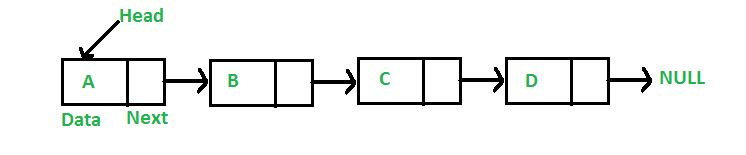
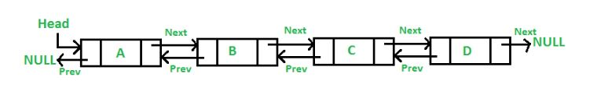

# Linked Lists
## Nodes, pointers and values oh my!

### What is a linked list?
You probably have some experience with regular python lists (called dynamic arrays.) The concept of dynamic arrays is fairly simple: Each item in the list is next to the previous item in memory. When an item is added, other items are moved towards the end. These are simple and make accessing data very easy. However, to become a good programmer, you need to have an addition tool in your arsenal: The linked list. A linked list is like a dynamic array, except for a few changes. First of all, each item in the list is NOT nessisarily next to each other in memory, so you cannot iterate through a linked list like you can a dynamic one. Instead linked list items are connected to eachother through *pointers*. Pointers are like an address that tells you where something is. Items in a linked list have their value, and a pointer to the next item in the list. In a doubly linked list (The more common one) also points to the previous item in the list. The first item is called the `head` and the last item is called the `tail`. Below is an example of a regular linked list:



Notice how it says 'null' at the end? More on that later.



See the difference? The doubly linked list points to both the next and the previous.

# Coding a Linked List
## Inserting
Inserting into a linked list is a little bit different than a dynamic array becuase we have to worrry about some additional features. In dynamic arrays, you simply can add to the end (or beginning or middle) and all is well. The other items get pushed to where they need to be. Linked lists don't really work in continuous order like that. Instead, when inserting into a linked list, we need to be concerened with what is the new items previous item, and what is the new items next item. First we will show you how to  insert into the head, then the tail, and then the slightly more challenging task; inserting into the middle. Inserting into the head requires the following steps:
```Python
def insert_head(self, value):
        """
        Insert a new node at the front (i.e. the head) of the
        linked list. This example is assuming you have a class for 
        your linked list and a child class called node for your
        items. This function is a method of LinkedList class.
        """
        # Step 1: Create the new node
        new_node = LinkedList.Node(value)  
        
        # Step 2: If the list is empty, then point both head and tail
        # to the new node. This means we have one node which is both
        # the head and the tail (beginning and end)
        if self.head is None:
            self.head = new_node
            self.tail = new_node
        # If the list is not empty, then only self.head will be
        # affected.
        else:
            new_node.next = self.head # Step 3. Set the next of the new node to the current head
            self.head.prev = new_node # Step 4. Set the prev of the current head to be the new node
            self.head = new_node      # Step 5. Set the head equal to the new node
```
When inserting into the tail is very similar to inserting into the head. Here is how you do it:
```Python
def insert_tail(self, value):
        """
        Insert a new node at the back (i.e. the tail) of the 
        linked list. This example is assuming you have a class for 
        your linked list and a child class called node for your
        items. This function is a method of LinkedList class.
        """
        # Step 1: Make the new node
        new_node = LinkedList.Node(value)  

        # Step 2: Same as with head. If there is nothing in the linked
        # list, the head and tail are the same.
        if self.head is None:
            self.head = new_node
            self.tail = new_node
        # The following steps are also the same as when inserting into the 
        # head, only they are inversed.
        else:
            new_node.prev = self.tail # Step 3. Set the prev of the new node to the current head
            self.tail.next = new_node # Step 4. Set the next of the current tail to be the new node
            self.tail = new_node      # Step 5. Set the tail to be equal to the new node
```
Inserting into the middle requires a few additional steps as shown below: 
```Python
def insert_middle(self, value):
"""
Function designed for inserting into the middle of a linked list
"""
# Step 1: Make the new node
new_node = LinkedList.Node(value)

# Step 2: Set the prev of the new node to the current node
new_node.prev = current

# Step 3: Set the next of the new onode to the next node after current
new_node.next = current.next

# Step 4: Set the prev of the next node after current to the new node
current.next.prev = new_node

# Step 5: Set the next of the current node to the new node
current.next = new_node

```
It may seem a bit maticulous to follow all these steps when inserting into a list, but doing so ensures the list maintains integrity. It is vital that you do not skip any of these steps.
## Removing
Removing from the head and tail of a linked list is as you guessed, similar! We simply have to update the second node for heads, or the second to last node for tails. If there is only one node in your linked list, then set both the head and the tail to None. Anyways, here is how you remove the head
```Python
def remove_head(self):
        """ 
        Remove the first node (i.e. the head) of the linked list.
        """
        # Step 1: Check to see if the head and tail are the same (one item)
        # If this is the case, make both None.
        if self.head == self.tail:
            self.head = None
            self.tail = None

        elif self.head is not None:
            self.head.next.prev = None  # Step 2: Set the prev of the second node to nothing
            self.head = self.head.next  # Step 3: Set the head to be the second node
```

And here is how you remove the tail:
```Python

def remove_tail(self):
    """
    Remove the last node (i.e. the tail) of the linked list.
    """
    # Step 1: Make the head and tail None if there is only one item
    if self.head == self.tail:
        self.head = None
        self.tail = None

    elif self.tail is not None:
        self.tail.prev.next = None # Step 2: Set the next of the second to last node to nothing
        self.tail = self.tail.prev # Step 3: Set the tail to be the second to last node
```

And finally, here is how to remove from the middle
```Python
"""
Becuase you cannot simply use an index to find a value in a linked
list, removing from the middle often includes traversing the list and 
keeping track of the current item. There will be more examples on this
in the following section regarding how to traverse a linked list.
"""
# Step 1: Define current and starting at the head, traverse till you find the 
# item you would like to remove.

# Step 2: Once found, set the prev of the node after current ot the node before current
current.next.prev = current.prev

# Step 3: Set the next of the node before current to the node after current
current.prev.next = current.next
```

## Traversing
Now we get to the fun part, traversing the linked list! This is something you may be required to know in your future tech interviews. Remember how those images above showed 'Null' at the end? That means there is no node there, and we can use this to help us traverse the list! To do this we will start at the head, and then work forward jumping to the next item until we have found our end (null), here is how it is done:

```Python
def go_forward(self):
    # Step 1: Make the current equal to the head
    current = self.head

    # Step 2: Loop through our list until there are no more items
    while current is not None:

        # Step 3: Add any code you would like
        print(current.value)

        # Step 4: Set the current to be the next item
        current = current.next
```

# Advantages
The preformance of linked lists is similar to dynamic arrays when inserting into the middle or then end. Where a linked list shines however, is when inserting into the middle. To do so in a dynamic array requires O(n), but in t linked list, this can be achieved using O(1). Please refer to this chart:

  Operation   | Dynamic Array | Linked List
------------- | ------------- | --------
Insert Front  |      O(n)     | O(1)
Insert Middle |      O(n)     | O(n)
Insert End    |      O(1)     | O(1)
Remove Front  |      O(n)     | O(1)
Remove Middle |      O(n)     | O(n)
Remove end    |      O(1)     | O(1)

# Challenge Problems
## Problem One
Now time for our first challenge problem! Let's say you have to remove all items in a linked list with a specific value. How would we do that? Well first, we would need to create our linked list, then we would need to traverse the list, and using an if statment check if it is the correct value. Then we should remove that value. Here is how:
```Python
class LinkedList:
    """
    Implement the LinkedList data structure.  The Node class below is an 
    inner class.  An inner class means that its real name is related to 
    the outer class.  To create a Node object, we will need to 
    specify LinkedList.Node
    """

    class Node:
        """
        Each node of the linked list will have data and links to the 
        previous and next node. 
        """

        def __init__(self, data):
            """ 
            Initialize the node to the data provided.  Initially
            the links are unknown so they are set to None.
            """
            self.data = data
            self.next = None
            self.prev = None

    def __init__(self):
        """
        Initialize an empty linked list.
        """
        self.head = None
        self.tail = None

    def insert_head(self, value):
        """
        Insert a new node at the front (i.e. the head) of the
        linked list.
        """
        # Create the new node
        new_node = LinkedList.Node(value)  
        
        # If the list is empty, then point both head and tail
        # to the new node.
        if self.head is None:
            self.head = new_node
            self.tail = new_node
        # If the list is not empty, then only self.head will be
        # affected.
        else:
            new_node.next = self.head # Connect new node to the previous head
            self.head.prev = new_node # Connect the previous head to the new node
            self.head = new_node      # Update the head to point to the new node

    def insert_tail(self, value):
        """
        Insert a new node at the back (i.e. the tail) of the 
        linked list.
        """
        new_node = LinkedList.Node(value)  

        if self.head is None:
            self.head = new_node
            self.tail = new_node

        else:
            new_node.prev = self.tail
            self.tail.next = new_node
            self.tail = new_node


    def remove_head(self):
        """ 
        Remove the first node (i.e. the head) of the linked list.
        """
        # If the list has only one item in it, then set head and tail 
        # to None resulting in an empty list.  This condition will also
        # cover an empty list.  Its okay to set to None again.
        if self.head == self.tail:
            self.head = None
            self.tail = None
        # If the list has more than one item in it, then only self.head
        # will be affected.
        elif self.head is not None:
            self.head.next.prev = None  # Disconnect the second node from the first node
            self.head = self.head.next  # Update the head to point to the second node


    def remove_tail(self):
        """
        Remove the last node (i.e. the tail) of the linked list.
        """
        if self.head == self.tail:
            self.head = None
            self.tail = None

        elif self.tail is not None:
            self.tail.prev.next = None
            self.tail = self.tail.prev


    def remove(self, value):
        """
        Searrch for all instances of a value
        """
        # new_node = LinkedList.Node(new_value) 
        curr = self.head
        while curr is not None:
            if curr.data == value:               

                if curr == self.head:
                    self.remove_head()
                    

                elif curr == self.tail:
                    self.remove_tail()
                    

                else:
                    curr.next.prev = curr.prev
                    curr.prev.next = curr.next


            curr = curr.next # Go to the next node to search for 'value'

    def __iter__(self):
        """
        Iterate foward through the Linked List
        """
        curr = self.head  # Start at the begining since this is a forward iteration.
        while curr is not None:
            yield curr.data  # Provide (yield) each item to the user
            curr = curr.next # Go forward in the linked list


    def __str__(self):
        """
        Return a string representation of the linked list.
        """
        output = "linkedlist["
        first = True
        for value in self:
            if first:
                first = False
            else:
                output += ", "
            output += str(value)
        output += "]"
        return output

    
# Sample Test Cases (may not be comprehensive) 
print("\n=========== PROBLEM TESTS ===========")
ll = LinkedList()
ll.insert_tail(1)
ll.insert_head(2)
ll.insert_head(2)
ll.insert_head(2)
ll.insert_head(3)
ll.insert_head(4)
ll.insert_head(5)
print(ll) # linkedlist[5, 4, 3, 2, 2, 2, 1]
ll.remove(5)
print(ll) # linkedlist[4, 3, 2, 2, 2, 1]
ll.remove(2)
print(ll) # linkedlist[4, 3, 1]
```

## Problem Two
Now time to spice things up a little. Edit the program so that it still removes each instance of a value, but also that after the loop, it displays how many instances of that value were found. For example, if we were to do ll.remove(5), our funciton should output: "1 instance of the value 5", and if we were to do 2, it should print "3 instances of the value 2". 
## Solution
please try to work on this for at least an hour. If you still need help feel free to look over the solution code:
[Solution](linkedlistsolution.py)

## Return Home
[Home Page](home.md)