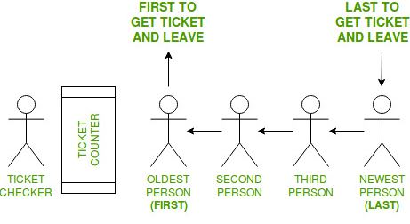

# Queue
## First in, first out (FIFO)

### What is a queue?
Imagine this: You have a question with BYU-Idaho regarding a recent scholarship you were awarded. You call the schools phone number and they ask you to wait for the next available associate. This is as queue! A queue is an order that is charachterized by having a first in, first out structure. When you made that call, you solidified your in the chain. Let's say you are spot seven when you call. When the person being helped ([0]) is done, you will then become spot number 6. Here is an example with a list from python:

```python
my_queue = [0,1,2,3,4,5,6,7,8,9]
```

As you can see, each value is an interger that also coincidentally represents it's index (this is not needed for queues, we only do this for demonstration purposes.) The next person to be helped would be my_queue[0]. After helping them, we need to delete them from the queue and move everyone else up. If someone is added to the queue, they will simply be added to the back. Removing my_queue[0] from the list would make my_queue[1], the new my_queue[0], my_queue[2] the new my_queue[1] and so forth. The image below might help you visualize FIFO in a practical setting:




# Code Examples
## Enqueue
Enqueue is when you add a value to the back of your list. Here is the code on how to do that:

```python
my_queue = [0,1,2,3,4,5,6,7,8,9]
my_new_value = 10
# The next step is rather simple, you have done this to lists before
my_queue.append(my_new_value)
# The new list should now be [0,1,2,3,4,5,6,7,8,9,10]
```

## Dequeue

To dequeue your first value in a list, simply pop the first index. It should go without saying to complete all work needed with my_queue[0] before you pop it. Herfe is the code:

```python
my_queue = [0,1,2,3,4,5,6,7,8,9,10]
my_new_value = my_queue[0]
# The next step is rather simple, you have done this to lists before
my_queue.pop(0)
# The new list should now be [1,2,3,4,5,6,7,8,9,10]
```

# Example Problem

Now, imagine you have been hired by BYU-Idaho's customer service department and it is your job to program their queue. You might solve the porblem something like this. (In the field, it is more likley to be working with additional files to read from, but this is outside th scope of this assignement so we will stick with inputs)

```python
customer_queue = []

openhours = True

while openhours:
    choice = input("To add a customer to queue, press 1. To remove a customer, press 2. To close for the day, press 3.")

    if choice == '1':
        name = input("Please enter the customers name: ")
        customer_queue.append(name)

    elif choice == '2':
        customer_queue.pop(0)

    else:
        openhours = False

```

# Challenge Problem

Now it is your turn. You are working for an apartment complex. This apartment has two kinds of rooms, one bedroom, and two bedroom. You will have a list of customers. Each customer will have a key value pair and choose one bedroom, two bedroom, or either. You must program a queue structure that also takes into consideration layout preference. Here is a list you should copy into your program at the top:

```python
appartment_queue = [{'name':'Jessie', 'type':'one'},{'name':'Herbert', 'type':'both'},{'name':'Sam', 'type':'one'},{'name':'John', 'type':'two'},{'name':'Peter', 'type':'two'},{'name':'Michael', 'type':'both'},{'name':'Noah', 'type':'both'},{'name':'Ron', 'type':'one'},]
```

You will create a while loop that exists as long as the user wants, and ask the user for the next available appartment type. Then starting at the front, check if there is a match (a 'both' preference would work for either one or two bedroom) Highlighted text represents input:

Please enter the appartment type (type '0' to be done): `two`

Herbert has been removed from the list.

Please enter the appartment type (type '0' to be done): `one`

Jessie has been removed from the list.

Please enter the appartmen type (type '0' to be done): `0`

*Program Closes*

# Solution

please try to work on this for at least an hour. If you still need help feel free to look over the solution code:
[Solution](queuesolution.py)

## Return Home
[Home Page](home.md)

